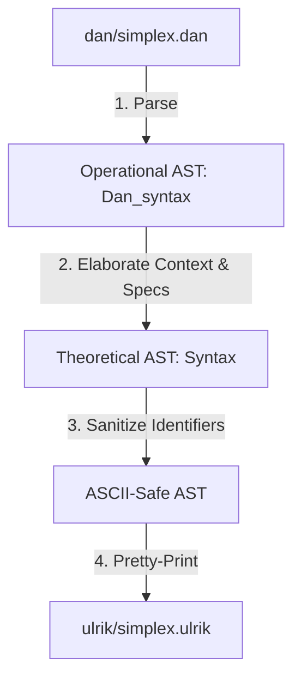

# The Lift 

The `lift` utility is the compiler and translation bridge between the **operational** layer of the system (the `Dan` language) and the **theoretical** layer (the `Ulrik` language). It elaborates low-level combinatorial and algebraic constructs into high-level type-theoretic definitions.

---

## General Description & Workflow

The `lift` binary automates the translation of operational files (`.dan`) to theoretical files (`.ulrik`). It operates as follows:



1. **Parsing:** Reads a `.dan` source file, lexes and parses it into the operational AST defined in [dan_syntax.ml](file:///Users/tonpa/depot/groupoid/ulrik/src/operational/dan_syntax.ml).
2. **Context & Spec Folding:** Translates operational contexts (`П (context) ⊢ ...`) into theoretical types and terms. 
   - Hypotheses are folded into dependent product types (`EPi` / `->`) in the type signature.
   - Hypotheses are folded into lambda terms (`ELam` / `\`) in the definition body.
   - Simplex/geometric specifications are packaged into nested product/Sigma (`ESig` / `*`) types.
3. **Identifier Sanitization:** The theoretical lexer only accepts ASCII characters. `lift` translates Unicode mathematical symbols (like boundary operator `∂`, non-ASCII vowels like `ö`, and subscript digits `₀`-`₉`) into clean ASCII representations (e.g. `Mobius`, `d10`).
4. **Pretty-Printing:** Translates the theoretical AST back into the `.ulrik` surface syntax.

### Usage

To compile the project and translate an operational `.dan` file into a theoretical `.ulrik` file:

```bash
# Build the lift binary
dune build

# Translate operational file
dune exec lift library/dan/simplex.dan > library/ulrik/simplex.ulrik
```

---

## Note: Möbius Strip Representations

Below is a comparison between the two representations of the Möbius strip found in the system: the combinatorial simplicial representation in the operational layer and the synthetic homotopy-theoretic fibration in the Anders HoTT library.

### 1. Simplicial / Combinatorial Representation (`Möbius` in Dan/Ulrik)
The definition of `Möbius` in `simplex.dan` is a combinatorial description of a 2-simplex (triangle):

```
def Möbius : Simplex
 := П (a b c : Simplex),
      (bc ac : Simplex), ab = bc ∘ ac
    ⊢ 2 (a b c | bc ac ab)
```

* **A Single 2-Simplex (Triangle):** It defines a 2-cell (rank 2 simplex) with vertices $a, b, c$, and boundary faces (edges) $bc, ac$, and $ab$, subject to the composition constraint $ab = bc \circ ac$.
* **Contractible Disk:** Topologically, a single 2-simplex is homeomorphic to a disk $D^2$, which is contractible (homotopy equivalent to a point $*$).
* **Building Block:** By itself, this term is not the global Möbius strip. To construct a Möbius strip simplically, you must define a simplicial complex (or simplicial set) by gluing multiple such triangles together (identifying vertices and edges) with a twist. The `Möbius` term in `simplex.dan` is a single oriented triangle configured for such a construction.

### 2. Synthetic HoTT Fibration (`moebius` in Anders)
The definition of `moebius` in `hopf.anders` is a high-level, synthetic homotopy-theoretic fibration:

```haskell
def notK : Π (b : 𝟐), Path 𝟐 (not (not b)) b := ind₂ (λ (b : 𝟐), Path 𝟐 (not (not b)) b) (idp 𝟐 0₂) (idp 𝟐 1₂)
def notEquiv : equiv 𝟐 𝟐 := (not, isoToEquiv 𝟐 𝟐 not not notK notK)
def moebius : S¹ → U := S1-ind (λ (_ : S¹), U) 𝟐 (ua 𝟐 𝟐 notEquiv)
```

* **A Vector Bundle / Fibration:** It is a type family (fibration) `moebius : S¹ → U` over the circle $S^1$ (defined as a Higher Inductive Type).
* **The Fiber:** The fiber over the basepoint is the discrete two-point space $\mathbf{2}$ (representing the boundaries of the interval or the orientation state).
* **The Twist (Univalence):** The transport along the path constructor `loopS1` of the circle is defined via the univalence axiom (`ua`) using the non-trivial automorphism `notEquiv` (boolean negation `not`). 
* **The Full Space:** The total space $\sum_{x : S^1} \text{moebius}(x)$ is the Möbius strip itself (specifically, the double cover of the circle).

### Comparison

| Attribute | Simplicial / Dan Kan (`Möbius`) | Synthetic HoTT (`moebius`) |
| :--- | :--- | :--- |
| **Framework** | General Computer Algebra (GAP-like) / Simplicial Sets | Homotopy Type Theory (HoTT/Cubical) |
| **Type** | A product of Simplex variables and relations | A function/family `S¹ → U` |
| **Homotopy Type** | Contractible ($*$) | Homotopy equivalent to a circle ($S^1$) |
| **Mechanism of Twist** | Specified via boundary face mappings in coordinates | Specified via univalent path induction (`ua`) along the loop |
| **Role** | A local 2-cell configuration (building block) | The global non-trivial fiber bundle (total space) |

### Connection
The two representations are connected via **geometric realization**:
If you assemble multiple local simplicial building blocks (such as the `Möbius` triangle and `twisted_annulus` from `simplex.dan`) into a simplicial set $X$ that glues the boundary with a twist, the geometric realization $|X|$ of that simplicial set will be homeomorphically (and thus homotopy) equivalent to the total space of the HoTT fibration:
$$|X| \simeq \sum_{x : S^1} \text{moebius}(x)$$
