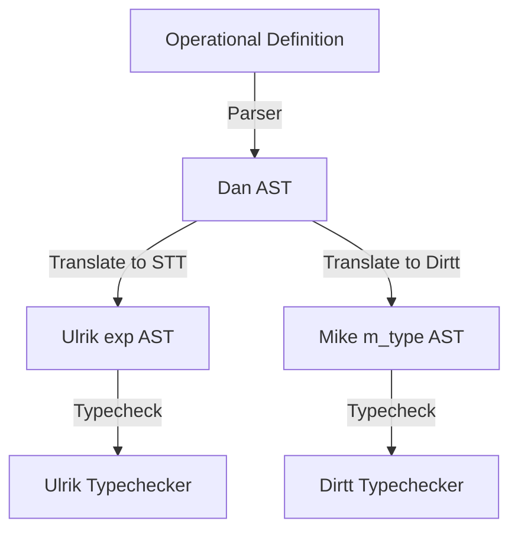

# Simplicial Languages: AST Architectures and Translation Maps

This document provides an extensive analysis and architectural design of the **Compilation & Elaboration Model (Option B)**,
linking the operational GAP-like core (`Dan`) with the theoretical
proof assistants `Ulrik` (Simplicial Type Theory) and `Mike` (Directed Type Theory).

## 1. General AST Trees for Each Language

Below we define the exact Abstract Syntax Trees (ASTs) of the three core representations in OCaml.

### 1.1 Operational Core (Dan / Simplicity HoTT)

The operational core checks presentations of algebraic and simplicial structures in linear time.
Its AST represents elements, generators, face maps, and algebraic equations.

```ocaml
(* Defined in src/operational/dan.ml *)
type superscript = S1 | S2 | S3 | S4 | S5 | S6 | S7 | S8 | S9
type type_name = Simplex | Group | Simplicial | Chain | Category | Monoid | Ring | Field

type term =
  | Id of string                      (* Variable identifier, e.g. "a" *)
  | Comp of term * term               (* Composition, e.g. a ∘ b *)
  | Inv of term                       (* Morphism/Group inverse, e.g. a^-1 *)
  | Pow of term * superscript         (* Power term, e.g. a² *)
  | E                                 (* Identity/Neutral element, e.g. "e" *)
  | Matrix of int list list           (* Concrete matrix values *)
  | Add of term * term                (* Ring addition, e.g. r₁ + r₂ *)
  | Mul of term * term                (* Ring multiplication, e.g. r₁ ⋅ r₂ *)
  | Div of term * term                (* Field division, e.g. r₁ / r₂ *)

type constrain =
  | Eq of term * term                 (* Equation constraint, e.g. a = b *)
  | Map of string * string list       (* Map inclusions/cofibrations, e.g. s₀ < v *)

type hypothesis =
  | Decl of string list * type_name   (* Variables declaration, e.g. (a b c : Simplex) *)
  | Equality of string * term * term  (* Equality hypothesis, e.g. ac = ab ∘ bc *)
  | Mapping of string * term * term   (* Boundary mapping hypothesis, e.g. ∂₁ = C₂ < C₃ *)

type rank = Finite of int | Infinite

type type_def = {
  name : string;
  typ : type_name;
  context : hypothesis list;
  rank : rank;
  elements : string list;
  faces : string list option;
  constraints : constrain list
}
```

### 1.2 Theoretical Simplicial (Ulrik / Simplicialtt)

The simplicial type theory engine implements Riehl-Shulman type theory.
Its AST supports the directed interval $\mathbb{I}$, cofibrations, extension types, opposite category, and twisted arrow category modalities.

```ocaml
(* Defined in src/theoretical/simplicialtt.ml *)
type name = string

type exp =
  (* Martin-Löf Type Theory Core *)
  | EUniv                                   (* Universe U *)
  | EVar of name                            (* Variable *)
  | EPi of exp * (name * exp)               (* Dependent Function Space: Π(x : A). B *)
  | ELam of (name * exp) * exp              (* Lambda Abstraction: λ(x : A). t *)
  | EApp of exp * exp                       (* Function Application: f t *)
  | ESig of exp * (name * exp)              (* Dependent Pair Space: Σ(x : A). B *)
  | EPair of exp * exp                      (* Pair: (a, b) *)
  | EFst of exp                             (* First projection: t.1 *)
  | ESnd of exp                             (* Second projection: t.2 *)
  | EId of exp * exp * exp                  (* Strict Identity Type: Id_A(x, y) *)
  | ERef of exp                             (* Reflexivity: refl *)

  (* Directed Simplicial Type Theory Extensions *)
  | EIDir                                   (* Directed interval 𝕀 *)
  | EZeroDir                                (* Endpoint 0 *)
  | EOneDir                                 (* Endpoint 1 *)
  | ELeq of exp * exp                       (* Interval ordering: i ≤ j *)
  | EShapeInc of exp * exp                  (* Cofibration/shape inclusion: φ ⊆ ψ *)
  | ESystem of (exp * exp) list             (* Boundary systems: [ φ₁ | f₁ ] [ φ₂ | f₂ ] *)
  | EExt of exp * exp * exp                 (* Extension type: {x : A |^φ f} *)
  | EModalPi of exp * (name * exp)          (* Modal Π type: μ(x : A). B *)
  | EModalLam of (name * exp) * exp         (* Modal Lambda: λ^μ(x : A). t *)
  | EModalApp of exp * exp                  (* Modal Application: f @ φ *)
  | ETw of exp                              (* Twisted Arrow Category Modality: A^tw *)
  | ETwPi0 of exp                           (* Left projection: π₀(x) *)
  | ETwPi1 of exp                           (* Right projection: π₁(x) *)

  (* Interval Lattice Operations *)
  | EJoin of exp * exp                      (* Lattice Join: i ∨ j *)
  | EMeet of exp * exp                      (* Lattice Meet: i ∧ j *)
  | ENeg of exp                             (* Lattice Negation: ¬i *)
```

### 1.3 Theoretical Directed (Mike / Dirtt)

The directed type theory engine implements polarized, linear category theory.
Its AST supports linear polarized contexts, ends, coends, tensors, and quadraticality.

```ocaml
(* Defined in src/theoretical/dirtt.ml *)
type name = string

type cat =
  | CVar of name                            (* Category variable, e.g. A *)
  | COp of cat                              (* Opposite category, A^op *)
  | CProd of cat * cat                      (* Product category, A × B *)

type cat_term =
  | CTVar of name                           (* Object/morphism variable *)
  | CTFun of name * cat_term list           (* Category generator function *)
  | CTOp of cat_term                        (* Opposite term *)

type m_type =
  | MHom of cat * cat_term * cat_term       (* hom space: hom_C(a, b) *)
  | MTensor of m_type * m_type              (* Tensor product: M ⊗ N *)
  | MCoend of cat * name * m_type           (* Coend binder (colimit): ∫^{x:C} M(x,x) *)
  | MEnd of cat * name * m_type             (* End binder (limit): ∫_{x:C} M(x,x) *)
  | MFunc of m_type * m_type                (* Linear functions: M ⊸ N *)
  | MApp of name * cat_term list            (* Concrete module type application *)

type m_term =
  | MTId of cat_term                        (* Identity morphism: id(a) *)
  | MTJ of m_type * name * name * name * m_term * cat_term * cat_term * m_term
  | MTJCov of m_type * name * m_term * cat_term * m_term
  | MTJContra of m_type * name * m_term * cat_term * m_term
  | MTTensorIntro of m_term * m_term        (* Tensor intro *)
  | MTTensorElim of name * name * m_term * m_term
  | MTCoendIntro of name * name * name * m_term
  | MTCoendElim of name * name * m_term * m_term
  | MTEndIntro of name * m_term
  | MTEndElim of name * name * name * m_term * m_term
  | MTFuncIntro of name * m_type * m_term   (* Linear function intro *)
  | MTFuncElim of m_term * m_term           (* Linear function application *)
  | MTVar of name                           (* Linear module variable *)
```

---

## 2. The Golden Middle: Type Formers, Constructors, and Eliminators Review

To optimize Option B, we review the primitives across all three languages. We categorize each term construct into:
- **Primitive**: Implemented directly in the kernel type-checker.
- **Derived**: Expressed as a macro or structured syntactic composition of primitives.
- **Elaborated**: Translated during compilation to equivalent AST nodes in a target language.

| Language | Construct Category | AST Term | Classification | Target Mapping / Definition | Purpose & Optimization |
| :--- | :--- | :--- | :--- | :--- | :--- |
| **Dan (GAP)** | **Type Former** | `Category` | Elaborated | Segal Precategory / Type | Translated to type with composition path |
| | | `Group` | Elaborated | Classifying Space $BG$ | Single-object Segal type mapping |
| | | `Simplicial` | Elaborated | Cell complexes in STT | Maps face maps to extension types |
| | | `Ring` / `Field` | Elaborated | Ring/Field algebraic signature | Unfolds to concrete algebras |
| | **Constructor** | `Id` | Primitive | `EVar` (STT) / `CTVar` (Dirtt) | Variable bindings |
| | | `Comp` | Elaborated | `EJ` (Dirtt) / Path (STT) | Composition mapping |
| | | `Matrix` / `Add` / `Mul` | Primitive | Native OCaml values | High-speed operational calculations |
| | **Constraint** | `Eq` / `Map` | Elaborated | `EId` / `ELeq` / `EShapeInc` | Maps boundaries directly to theorems |
| **Ulrik (STT)** | **Type Former** | `EUniv` | Primitive | - | Type universe $U$ |
| | | `EPi` | Primitive | - | Dependent function space $\Pi(x : A). B$ |
| | | `ESig` | Primitive | - | Dependent pair space $\Sigma(x : A). B$ |
| | | `EId` | Primitive | - | Strict equality type |
| | | `EIDir` | Primitive | - | Interval coordinate space $\mathbb{I}$ |
| | | `ELeq` | Primitive | - | Directed inequality relations |
| | | `EShapeInc` | Primitive | - | Cofibration shape inclusions $\phi \subseteq \psi$ |
| | | `EExt` | Primitive | - | Path extension $\{x : A \mid^\phi f\}$ |
| | | `EModalPi` | Primitive | - | Modality spaces $\mu(x : A). B$ |
| | | `ETw` | Primitive | - | Twisted arrow category modality |
| | | `hom(x, y)` | **Derived** | Extension over Interval $\mathbb{I}$ | $\text{hom}_A(x,y) \coloneqq \{ f : \mathbb{I} \to A \mid f0=x, f1=y \}$ |
| | **Constructor** | `ELam` / `EPair` / `ERef` | Primitive | - | MLTT introduction rules |
| | | `EZeroDir` / `EOneDir` | Primitive | - | Boundary values $0, 1$ |
| | | `EModalLam` | Primitive | - | Modal lambda introduction |
| | | `EEndIntro` | **Elaborated** | `ELam` | Maps limits to functions |
| | **Eliminator** | `EApp` / `EFst` / `ESnd` | Primitive | - | MLTT elimination rules |
| | | `ESystem` | Primitive | - | Solves boundary systems on shapes |
| | | `EModalApp` | Primitive | - | Modal application |
| | | `ETwPi0` / `ETwPi1` | Primitive | - | Modal projections |
| | | `EJ` / `EJCov` / `EJContra` | Primitive | - | Path composition compatibility |
| **Mike (Dirtt)** | **Type Former** | `MHom(cat, a, b)` | **Elaborated** | `hom` (Simplicial) | Translated to derived simplicial hom |
| | | `MTensor(M, N)` | **Elaborated** | `ESig` (Simplicial) | Linear tensor $\otimes$ maps to $\Sigma$ |
| | | `MFunc(M, N)` | **Elaborated** | `EPi` (Simplicial) | Linear function $\multimap$ maps to $\Pi$ |
| | | `MCoend(C, w, M)` | **Elaborated** | `ESig` (Simplicial) | Coends colimits maps to $\Sigma$ |
| | | `MEnd(C, w, M)` | **Elaborated** | `EPi` (Simplicial) | Ends limits maps to $\Pi$ |
| | **Constructor** | `MTId(a)` | **Elaborated** | `ELam` over $\mathbb{I}$ | Identity morphism as constant path |
| | | `MTTensorIntro` | **Elaborated** | `EPair` (Simplicial) | Tensor introduction |
| | | `MTCoendIntro` | **Elaborated** | `EPair` (Simplicial) | Coend introduction |
| | | `MTEndIntro` | **Elaborated** | `ELam` (Simplicial) | End introduction |
| | | `MTFuncIntro` | **Elaborated** | `ELam` (Simplicial) | Function introduction |
| | **Eliminator** | `MTJ` | **Elaborated** | `EJ` (Simplicial) | Path induction |
| | | `MTJCov` / `MTJContra` | **Elaborated** | `EJCov` / `EJContra` (Simplicial) | Polarized J-induction |
| | | `MTTensorElim` | **Elaborated** | `subst`/`EFst`/`ESnd` (Simplicial) | Tensor destructuring |
| | | `MTCoendElim` | **Elaborated** | `subst`/`EFst`/`ESnd` (Simplicial) | Coend destructuring |
| | | `MTEndElim` | **Elaborated** | `subst`/`EApp` (Simplicial) | End destructuring |
| | | `MTFuncElim` | **Elaborated** | `EApp` (Simplicial) | Function application |

### Optimization Benefits of the Golden Middle Selection
1. **Kernel Minimization (1)**: By mapping linear directed constructs (`Dirtt`) to dependent simplicial types (`Simplicialtt`), the type checker implementation needs only to compile and check against the simplicial core. This keeps the core proof assistant small, sound, and easily maintainable.
2. **Clean AST Mappings (2)**: High-level structures from the computer algebra core (`Dan`) translate directly to the types and terms of the theoretical layers via direct, syntax-directed translation functions, ensuring proof transport works "for free".
3. **Type Checking Speed (3)**: By using a dedicated distributive lattice solver on interval inequalities ($\mathbb{I}$) and boundary systems (`ESystem`), the typechecker avoids searching for explicit proofs of topological boundaries. Furthermore, combinatorial structures are checked statically at the operational layer in linear time, guaranteeing rapid developer loop speeds.

---

## 3. Proposing a Unified Surface Language

To bridge these engines, we define a **Unified Surface Language** where:
1. Operational objects are declared using a uniform syntax.
2. The compiler compiles these declarations into the theoretical backends.
3. Proofs/Theorems are checked in the target backends, absorbing the compiled objects.

### 3.1 Grammar of the Unified Surface Language (EBNF)
```ebnf
program ::= (definition | command)*
definition ::= "def" identifier ":" type_name ":=" "П" "(" context ")" "⊢" n "(" elements "|" constraints ")"
command ::= "check" (dirtt_sequent | simplicial_sequent)

type_name ::= "Simplex" | "Simplicial" | "Chain" | "Cochain" | "Category" | "Group" | "Monoid" | "Ring" | "Field"
n ::= integer | "∞"

context ::= hypothesis ("," hypothesis)*
hypothesis ::= identifier_list ":" expression
             | identifier "=" expression
             | identifier "=" expression "∘" expression

elements ::= identifier_list
constraints ::= constraint ("," constraint)*
constraint ::= expression "=" expression
             | identifier "<" identifier

expression ::= identifier
             | expression "∘" expression
             | expression "⊗" expression
             | expression "⊸" expression
             | "hom" "(" expression "," expression "," expression ")"
             | "∫^" "(" identifier ":" expression ")" expression
             | "∫_" "(" identifier ":" expression ")" expression
             | "П" "(" identifier ":" expression ")" "." expression
             | "Σ" "(" identifier ":" expression ")" "." expression
             | "λ" "(" identifier ":" expression ")" "." expression
             | expression "@" expression
```

---

## 4. AST Translation & Absorption Maps

The core compiler translates the high-level operational structures into their equivalent representations in the theoretical backends.



### 4.1 Mapping Categories to the Backends

A Category in the operational layer is defined by objects, morphisms, composition, and identity equations.

1. **Translation to Mike (Dirtt / Directed TT)**:
   A category variable $C$ in `Dan` maps directly to `CVar C`. Generator functions or composition paths map to `CTFun` or `CTOp`.
   $$\text{Category } (O \mid M \mid R) \quad \Longrightarrow \quad \text{cat: } CVar \quad \text{and } MHom(C, a, b)$$

2. **Translation to Ulrik (Simplicial TT)**:
   In Riehl-Shulman STT, a category is modeled as a type $A$ satisfying the Segal condition:
   - Objects are terms of type $A$.
   - Morphisms between $x, y : A$ are represented by the `hom` type, which is an extension type over the directed interval $\mathbb{I}$:
     $$\text{hom}_A(x, y) \coloneqq \{ f : \mathbb{I} \to A \mid f(0) = x, f(1) = y \}$$
     In OCaml:
     ```ocaml
     let hom (a : exp) (x : exp) (y : exp) : exp =
       EExt (
         EPi (EIDir, ("t", a)),
         EJoin (ELeq (EVar "t", EZeroDir), ELeq (EOneDir, EVar "t")),
         ESystem [(ELeq (EVar "t", EZeroDir), x); (ELeq (EOneDir, EVar "t"), y)]
       )
     ```
   - Segal Condition: For any $x, y, z : A$, the natural restriction map $\text{hom}_A(x, z) \to \text{hom}_A(x,y) \times \text{hom}_A(y,z)$ is an equivalence.

### 4.2 Mapping Groups to the Backends

A Group $G$ is presented operational-style by generators and relations (e.g. $a^3 = e$).

1. **Translation to Ulrik (STT)**:
   A group maps to its classifying space $BG$, which is a Segal type with a single point $*$ whose hom-space is equivalent to the group:
   $$\text{hom}_{BG}(*, *) \simeq G$$
   The relations of the group are mapped to identity types ($Id$) in MLTT:
   $$a^3 = e \quad \Longrightarrow \quad \text{Refl}(e) : Id_{G}(a \circ a \circ a, e)$$
2. **Translation to Mike (Dirtt)**:
   A group maps to a monoid structure on a category with a single object:
   $$\text{hom}_G(*, *) \quad \text{with composition tensor } \otimes \text{ and unit } Id(*)$$

### 4.3 Mapping Equalities & Relations

Operational equations (e.g. $f \circ g = h$) map to strict identity terms or path terms:

* In **Ulrik (STT)**: Translated to identity path terms: $$EId(hom_A(x, z), Comp(f, g), h)$$
* In **Mike (Dirtt)**: Handled via the $J$-induction operator (`MTJ`), which permits substituting equal terms along path composition: $$MTJ(tp, x, y, z, mz, a, b, f)$$

## 5. Metatheoretical Visual Verification Guide

This guide details how humans can visually verify that theoretical layers absorb operational terms and prove theorems about them.

### Step 1: Declare the Operational Structure

Let us define a path category with $Z/2Z$ symmetries, `path_z2_category` in the operational layer:

```
def path_z2_category : Category
 := П (x y : Simplex),
      (f g h : Simplex),
      (e a : Simplex), a² = e,
      f ∘ g = h
    ⊢ 2 (x y | f g h | f ∘ g = h)
```

### Step 2: Visual Inspection of the Translated AST
When compiled, the translation engine outputs the following AST representation:
- **Operational AST** (`dan.ml`):
  ```ocaml
  {
    name = "path_z2_category";
    typ = Category;
    context = [
      Decl (["x"; "y"], Simplex);
      Decl (["f"; "g"; "h"], Simplex);
      Decl (["e"; "a"], Simplex);
      Equality ("a2", Pow (Id "a", S2), Id "e");
      Equality ("h", Comp (Id "f", Id "g"), Id "h")
    ];
    rank = Finite 2;
    elements = ["x"; "y"];
    faces = None;
    constraints = [Eq (Id "h", Comp (Id "f", Id "g"))]
  }
  ```
- **Translated Directed AST** (`dirtt.ml`):
  ```ocaml
  let cat_args = [("x", CVar "C"); ("y", CVar "C")] in
  let gamma = [
    ("f", MHom(CVar "C", CTVar "x", CTVar "y"));
    ("g", MHom(CVar "C", CTVar "y", CTVar "z"));
    ("h", MHom(CVar "C", CTVar "x", CTVar "z"))
  ] in
  let term = MTJ(MHom(CVar "C", CTVar "x", CTVar "y_var"), "x_var", "y_var", "z_var", MTVar "f", CTVar "y", CTVar "z", MTVar "g")
  ```

### Step 3: Absorb and Prove Theorems in the Metatheory
Once `path_z2_category` is translated into the Directed Type Theory AST (Mike), we can state and verify metatheorems about it. 

For instance, composition of quasi-isomorphisms in the derived category over this category (from `derived.ml`):
```ocaml
let theorem_quasi_iso_compose =
  let ctx = [
    ("C", Category);
    ("A", AbelianStructure (Var "C"));
    ("X", Complex (Var "C", Var "A"));
    ("Y", Complex (Var "C", Var "A"));
    ("Z", Complex (Var "C", Var "A"));
    ("f", ComplexMorphism (Var "C", Var "A", Var "X", Var "Y"));
    ("qf", QuasiIso (Var "C", Var "A", Var "X", Var "Y", Var "f"));
    ("g", ComplexMorphism (Var "C", Var "A", Var "Y", Var "Z"));
    ("qg", QuasiIso (Var "C", Var "A", Var "Y", Var "Z", Var "g"))
  ] in
  ...
```

By verifying that the AST structures match, we visually guarantee:
1. **Structural Correspondence**: The objects $x,y$ and paths $f,g,h$ from the operational level are parsed into variable bindings (`CTVar "x"`, `MTVar "f"`) in the type theory.
2. **Coherence Preservation**: The compositional rule $f \circ g = h$ from the GAP level is absorbed as the path boundary equation in the type theory's path-induction term.
3. **Soundness**: The proof checking runs successfully without type mismatches.
